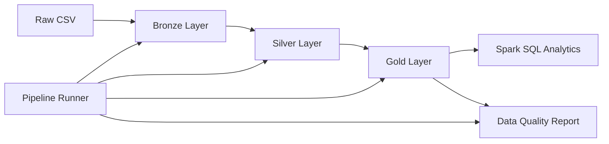

# Sales Data Pipeline with Databricks

A modern data engineering project that demonstrates a complete ETL pipeline using the Medallion Architecture (Bronze, Silver, Gold) on Databricks with Delta Lake and Spark SQL.

---

## Tech Stack

- PySpark
- Databricks
- Delta Lake
- Spark SQL
- Delta Tables
- Git & GitHub

---

## Project Architecture



---

## Project Structure

```
sales-data-pipeline/

├── bronze/
│   └── 01_load_bronze
│
├── silver/
│   └── 02_clean_silver
│
├── gold/
│   └── 03_build_gold
│
├── analytics/
│   └── 04_sql_analytics
│
├── quality/
│   └── 05_data_quality_report
│
├── pipeline/
│   └── 06_pipeline_runner
│
└── README.md
```

---

## Pipeline Overview

### Bronze Layer

- Load raw CSV data
- Standardize column names
- Store raw data in Delta Lake

### Silver Layer

- Convert data types
- Handle data quality checks
- Remove duplicate records
- Validate business rules

### Gold Layer

Generate business-ready tables

- Sales by Region
- Monthly Sales
- Top Products

### SQL Analytics

Business analysis using Spark SQL

- Sales by Region
- Monthly Sales Trend
- Top Products
- Profit by Category
- Customer Segments
- Shipping Performance

### Data Quality Report

Validate dataset quality

- Row Count
- Schema Validation
- Missing Values
- Duplicate Records
- Business Rule Validation

### Pipeline Runner

Execute the ETL pipeline

Bronze → Silver → Gold → Data Quality Report

---

## Data Flow

```
Raw CSV
    │
    ▼
Bronze
    │
    ▼
Silver
    │
    ▼
Gold
    │
    ├─────────────► Spark SQL Analytics
    │
    └─────────────► Data Quality Report
```

---

## Current Status

- Bronze Layer
- Silver Layer
- Gold Layer
- Spark SQL Analytics
- Data Quality Report
- Pipeline Runner

---

## Future Improvements

- Databricks Workflows
- Incremental Data Loading
- Unity Catalog
- Power BI Dashboard
- Automated Scheduling